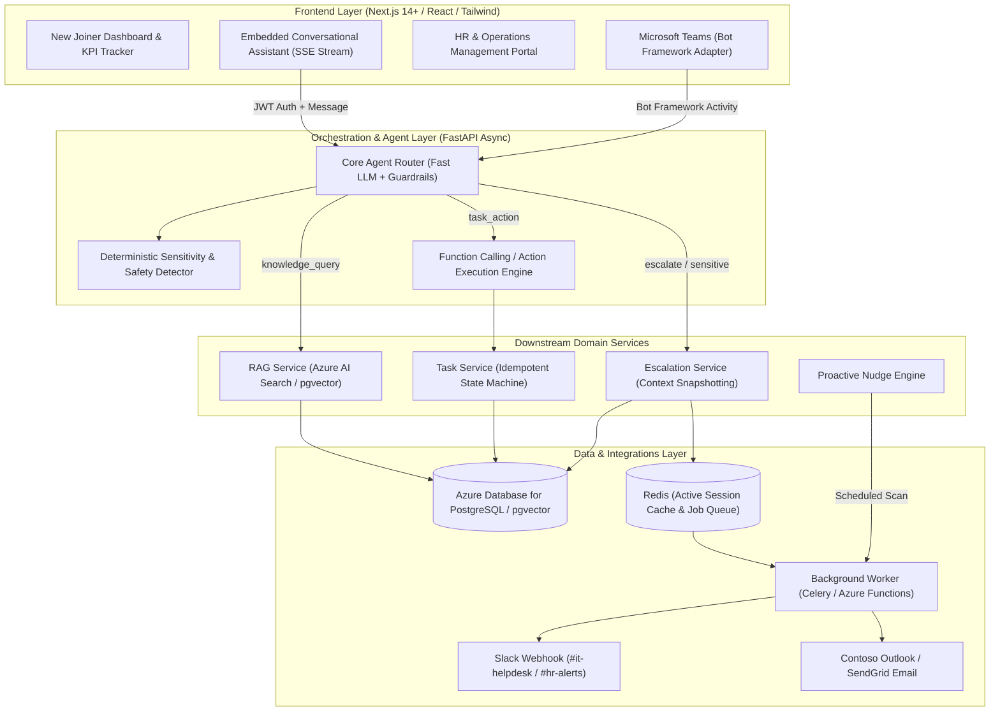

# Microsoft Innovate 2026 — Problem Statement PS15
# AI-Powered New Joiner Onboarding Assistant

[](https://www.python.org/)
[](https://fastapi.tiangolo.com)
[](https://nextjs.org/)
[](https://github.com/pgvector/pgvector)
[](https://azure.microsoft.com/en-us/products/ai-services/openai-service)
[](https://opensource.org/licenses/MIT)

An enterprise-grade, production-ready AI onboarding system designed for global Microsoft/enterprise teams. This system moves beyond basic FAQ chatbots by combining **Generative AI, Retrieval-Augmented Generation (RAG), autonomous agent function-calling, asynchronous background reminder workers, and safe human escalation triage**.

---

## 🏛️ System Architecture



### 1. Synchronous Path (Per Chat Interaction)
1. **User Message & JWT Verification**: Chat message submitted via web widget or Microsoft Teams bot webhook.
2. **Deterministic Guardrails & Fast LLM Classification**: Classified into `knowledge_query`, `task_action`, or `escalate`.
3. **Domain Dispatch**:
   - `knowledge_query`: Query embedded $\rightarrow$ top-$k$ relevant chunks retrieved $\rightarrow$ answer generated strictly constrained to retrieved context with document citations.
   - `task_action`: Agent executes function calling on user's behalf (e.g., mark task done, raise IT ticket, book orientation).
   - `escalate`: Triggered by sensitive topics (harassment, compensation dispute, visa/legal) or low confidence ($<0.70$). Captures recent conversation snapshot and enqueues HR priority ticket.
4. **Token-by-Token Streaming**: Response delivered over Server-Sent Events (SSE) directly to the UI.

### 2. Asynchronous Path (Scheduled Reminders & Escalations)
- **Background Worker**: Celery / Redis async worker scans for overdue tasks and triggers reminders.
- **Multi-Channel Dispatch**: Sends automated nudges via Slack API (`chat.postMessage`) and transactional email.
- **Human Handoff Alerts**: Dispatches instant webhook notifications to HR operations channels with full conversation context attached.

---

## 🚀 Key Features

| Feature | Description | Enterprise Grade Detail |
| :--- | :--- | :--- |
| **Personalized Checklist Generation** | Automatically generates task checklists keyed by **role** and **location**. | Template tasks copied on user creation (e.g. GitHub & SSH setup for Software Engineers in Redmond, UK Pension for London). |
| **Grounded RAG Q&A** | Answers employee questions using only uploaded corporate handbooks. | Never hallucinates. Strict fallback when answer is missing. Cites source file, section, and relevance score. |
| **Agent Router** | Structured JSON classification with confidence scoring. | Ambiguous or low-confidence queries ($<0.70$) default safely to human escalation, never guessing. |
| **Idempotent Task Tracking** | Dual-surface task status updates via dashboard and conversational agent. | Marking a completed task complete is a safe no-op. Dashboard and chat share a single source of truth. |
| **Autonomous Function Calling** | Agent performs workflows on user's behalf. | Tools for: `complete_task`, `list_tasks`, `raise_it_ticket`, `book_orientation_slot`, and `check_progress`. |
| **Human Handoff / Escalation** | Instant escalation for sensitive matters (compensation, harassment, visa, legal). | Generates empathetic user response, snapshots last 8 conversation turns, and files HR queue record. |
| **Proactive Nudge Engine** | Scheduled background worker scans for overdue onboarding tasks. | Sends reminders over Slack and Email. Includes on-demand fast-forward trigger for hackathon evaluation. |
| **HR & Admin Portal** | Real-time management interface. | View all new joiners' progress bars, manage checklist templates by role/location, and resolve open escalations. |
| **Microsoft Teams Bot Adapter** | Exposes the assistant via Azure Bot Service / Bot Framework SDK. | Reuses the same router, RAG pipeline, and database models. |

---

## 🛠️ Technology Stack & Azure Alignment

- **Frontend**: Next.js 14+ (App Router), React, Tailwind CSS, Lucide React, Server-Sent Events (SSE) streaming client.
- **Backend**: FastAPI (Python 3.12), fully async (`asyncpg`, `aiosqlite`, `asyncio`, `httpx`).
- **Database & Vector Store**: Azure Database for PostgreSQL with `pgvector` (universal SQLite+fallback supported for offline dev/tests).
- **Cache & Queue**: Redis 7 + Celery background worker.
- **AI & Embeddings**: Azure OpenAI Service (GPT-4o Chat Completions + `text-embedding-3-small` Embeddings).
- **Integrations**: Slack Web API (`slack-sdk`), SendGrid / Azure Communication Services Email, Microsoft Bot Framework Activity schema.

---

## ⚡ Quick Start with Docker Compose

To bring up the entire stack (PostgreSQL with pgvector, Redis, FastAPI Backend, Celery Worker, and Next.js Frontend) in one command:

```bash
# 1. Clone repository & configure environment variables
cp .env.example .env

# 2. Build and start all 5 containers
docker-compose up --build
```

- **Frontend Application**: `http://localhost:3000`
- **Backend API & Swagger Docs**: `http://localhost:8000/api/v1/docs`
- **Health Check**: `http://localhost:8000/health`

---

## 💻 Local Development Setup (Without Docker)

### 1. Backend Setup
```bash
cd backend

# Create virtual environment with uv or python3
uv venv .venv
source .venv/bin/activate

# Install dependencies
uv pip install -r requirements.txt

# Initialize database schema & seed initial templates, demo users, and RAG handbooks
python -m app.db.init_db

# Run FastAPI development server
uvicorn app.main:app --reload --port 8000
```

### 2. Frontend Setup
```bash
cd frontend

# Install dependencies
npm install

# Start Next.js development server
npm run dev
```

Visit `http://localhost:3000` in your browser.

---

## 🧪 Automated Test Suite

The test suite covers the Agent Router, RAG Pipeline, Task Service idempotency, and API endpoints:

```bash
cd backend
.venv/bin/pytest tests/ -v
```

**Test Coverage Highlights:**
- `test_agent_router.py`: Sensitivity regex guardrails, tool action classification, ambiguity fallback.
- `test_rag_service.py`: Document chunking, hybrid vector search, source citation extraction, out-of-domain fallback.
- `test_task_service.py`: Role/location checklist population, idempotent status updates, agent actions execution.
- `test_api.py`: JWT login, task status changes, chat streaming turns, Microsoft Teams bot webhook, HR escalation resolution.

---

## 👥 Demo Personas & Test Script

The application is pre-seeded with realistic enterprise user profiles for immediate testing:

| Persona | Role | Location | Purpose |
| :--- | :--- | :--- | :--- |
| **Sarah Chen** | Software Engineer | Redmond, WA | Engineering checklist (GitHub Enterprise, Intune MDM, SSH signing). |
| **Alex Rivera** | Product Manager | London, UK | Product checklist (Discovery shadowing, PRD publishing, UK Pension). |
| **Priya Sharma** | Software Engineer | Redmond, WA | Core AI engineer onboarding. |
| **Elena Rostova** | Director of People Operations | Redmond, WA | Admin / HR Portal access (Escalation queue, template editor, nudge triggers). |

### 5-Step Demo Script for Evaluators:
1. **Explore Personalized Checklist**: Switch between **Sarah Chen** and **Alex Rivera** in the top navigation to see role- and location-specific tasks automatically populated.
2. **Grounded RAG Q&A**: Open the AI Assistant chat widget and ask:
   > *"How much is the home office ergonomic allowance and how do I claim it?"*
   - Observe the streamed response citing `Contoso Employee Handbook (2026 Edition)` with the exact **$1,200** policy and SAP Concur submission window.
3. **Agent Action Execution**: In the chat widget, type:
   > *"Please mark my Multi-Factor Authentication task as completed"*
   - Observe the agent execute the action, display the **Agent Action Card**, and instantly update the checklist completion percentage.
4. **Trigger Human Escalation**: In the chat widget, type:
   > *"I have a serious concern regarding compensation equity and harassment"*
   - Observe the agent router classify this as sensitive, return an honest reassurance message, and file an **#ESC-XXXX** ticket. Switch to the **HR / Admin Portal** to inspect the conversation snapshot and resolve the ticket.
5. **Simulate Proactive Nudge**: In the Admin Portal under **Proactive Nudges**, click **Fast-Forward Nudges (Demo)** to inspect live reminder messages formatted for Slack and email.

---

## 🔒 Security & Industry-Grade Architecture
- **Zero-Trust Input Validation**: All payloads validated with Pydantic v2 models.
- **Fail-Safe Fallbacks**: If Azure OpenAI times out or is unreachable, the system falls back to a deterministic classifier and offline grounded summarization—never returning a 500 error to the employee.
- **Sensitive Topic Quarantine**: Sensitive topics bypass the LLM and are triaged immediately to human specialists with conversation context snapshots.
- **Idempotent Updates**: All task mutations and background jobs are idempotent, ensuring safe automated retries.
